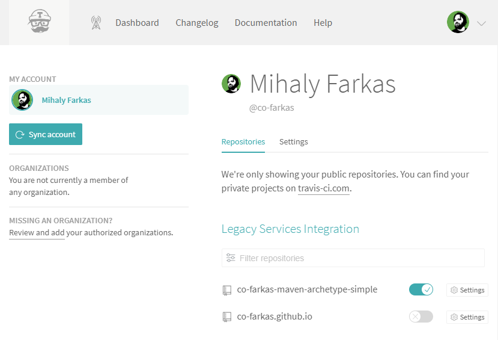

# Cookbook

## [Git][git]

### First-Time Setup 

```bash
git config --global user.email "mihaly@farkas.co"
git config --global user.name "Mihaly Farkas"
git config --global core.editor "nano"
```

### Delete tag

```bash
git tag -d 0.0.1
git push origin :refs/tags/0.0.1
```

## [Maven][maven]

### Check dependency updates

```bash
mvn versions:display-parent-updates versions:display-property-updates
```

### Update dependencies

```bash
mvn versions:update-properties
```

### Release

```bash
mvn release:prepare
```

## Travis CI

### Setup

Sync your [GitHub][github] account with [Travis CI][travis-ci].


[](https://travis-ci.org/account/repositories)


[git]:       https://git-scm.com/
[maven]:     https://maven.apache.org/
[github]:    https://github.com/
[travis-ci]: https://travis-ci.org/
