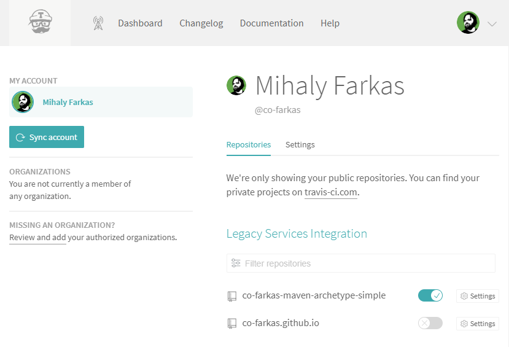
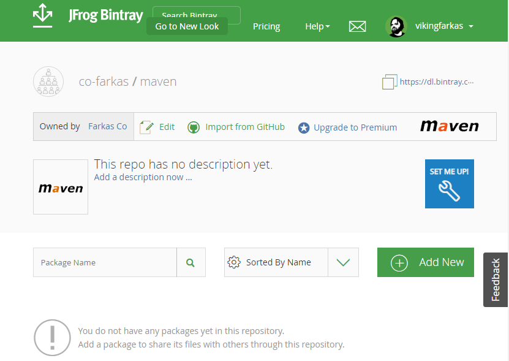
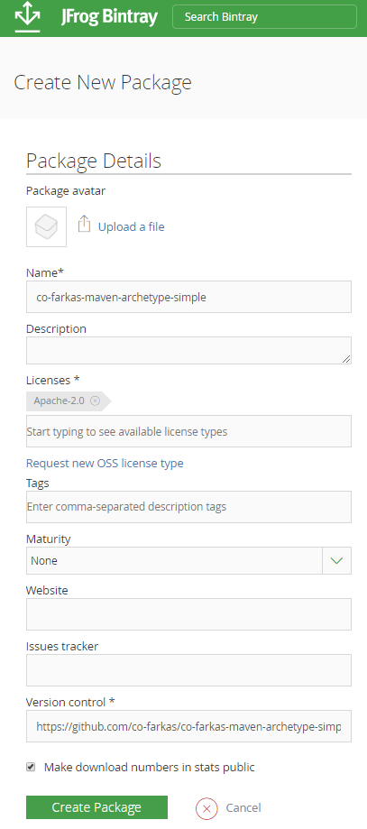

# Cookbook

## [Git][git]

### First-Time Setup 

```bash
git config --global user.email "mihaly@farkas.co"
git config --global user.name "Mihaly Farkas"
git config --global core.editor "nano"
```

### Delete tag

```bash
git tag -d 0.0.1
git push origin :refs/tags/0.0.1
```

## [Maven][maven]

### Check dependency updates

```bash
mvn versions:display-parent-updates versions:display-property-updates
```

### Update dependencies

```bash
mvn versions:update-properties
```

### Release

```bash
mvn release:prepare
```

## Travis CI

### Setup

Sync your [GitHub][github] account.


[](https://travis-ci.org/account/repositories)

### Encryption keys

See: https://docs.travis-ci.com/user/encryption-keys/

Example:

```bash
travis encrypt BINTRAY_USER="vikingfarkas" --add
travis encrypt BINTRAY_API_KEY="****************************************" --add
travis encrypt SONAR_ORGANIZATION="co-farkas-github" --add
travis encrypt SONAR_TOKEN="****************************************" --add
travis encrypt GITHUB_TOKEN="****************************************" --add
```

## Bintray

### Retrieve API Key

See: https://bintray.com/profile/edit (API Key)

### Setup

Create a package in your Maven repository.

[](https://bintray.com/co-farkas/maven/)

[](https://bintray.com/co-farkas/maven/new/package?pkgPath=)

## Github

### Retrieve Developer Token

See: https://github.com/settings/tokens

[git]:       https://git-scm.com/
[maven]:     https://maven.apache.org/
[github]:    https://github.com/
[travis-ci]: https://travis-ci.org/
[bintray]:   https://bintray.com/
